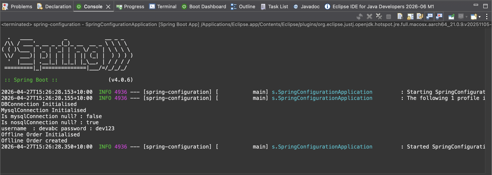

# Spring Boot Configuration Demo
This repository is a hands-on exploration of Spring Boot's externalized configuration and conditional bean management. I built this to learn how to use @Value, @ConditionalOnProperty, and @Profile to create adaptable applications.
## 🚀 Key Features

## 1. Externalized Configuration with @Value
I used @Value to inject settings directly from application.properties into my beans.

* Usage: @Value("${app.message:Default Message}")
* Why: This keeps the code clean by separating the logic from the actual data/settings.
* Example: @Value("${isOnlineOrder}") on AppConfig.java and @Value("${username}") in RealEmailService.java

## 2. Feature Toggling with @ConditionalOnProperty
This annotation allows the application to enable or disable specific beans based on a property value.

* Usage: @ConditionalOnProperty(prefix = "feature", value = "enabled", havingValue = "true", matchIfMissing = false)
* Why: It’s perfect for "feature flags," like switching between different payment gateways or turning on a specific background job only when needed.
* Example: @ConditionalOnProperty(prefix = "mysqlconnection", value = "enabled", havingValue = "true", matchIfMissing = false) in MysqlConnection.java

## 3. Profiling and Environment Management
I used the @Profile annotation to control which beans are loaded based on the active environment. This is essential for keeping development and production configurations separate.

* Usage: @Profile("dev") or @Profile("!prod")
* Why: This ensures that "heavy" beans (like a real database connection) only run in production, while mock beans run during development or testing.

* How it works: By marking a class or method with @Profile("dev"), Spring will only instantiate that bean if the "dev" profile is active.
* Multiple Profiles: You can use profiles to switch between different data sources (e.g., H2 for dev, PostgreSQL for prod) or mock vs. real external services. 

### ⚙️ How to Activate Profiles
You can activate specific profiles in your application using several methods:

   1. In application.properties:
   
   spring.profiles.active=dev
   
   2. Via Command Line Arguments:
   
   mvn spring-boot:run -Dspring-boot.run.profiles=prod
   
   3. Adding profiles in pom.xml and initiating it using below command
   
   mvn spring-boot:run -Pprod
   
------------------------------

## Output Screenshot

### Running with 'dev' profile

